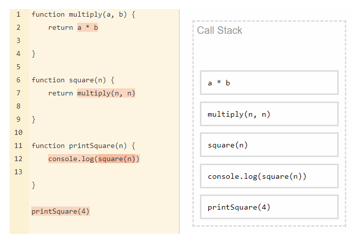

# Core JavaScript


## What is JavaScript?

JavaScript is a scripting or programming language that allows you to implement complex features on web pages. 

JavaScript is the programming language of the Web. The overwhelming majority of modern websites use JavaScript, and all modern web browsers—on desktops, game consoles, tablets, and smartphones—include JavaScript interpreters, making JavaScript the most ubiquitous programming language in history.

JavaScript is part of the triad of technologies that all Web developers must learn: HTML to specify the content of web pages, CSS to specify the presentation of web pages, and JavaScript to specify
the behavior of web pages. 


**Web Triad**

1. HTML: Creates the frame of a webpage.
2. CSS: Creates page styling.
3. Javascript: Does the functionality of the page.


## What can it really do?

The core client-side JavaScript language consists of some common programming features that allow you to do things like:

- Store useful values inside variables.
- Operations on pieces of text (known as "strings" in programming). 
- Running code in response to certain events occurring on a web page. 
- And much more!


## Characteristics


### Interpreted

You might hear the terms **interpreted** and **compiled** in the context of programming. In interpreted languages, the **code is run from top to bottom and the result of running the code is immediately returned.** You don't have to transform the code into a different form before the browser runs it.

Compiled languages on the other hand are transformed (compiled) into another form before they are run by the computer. For example, C/C++ are compiled into machine code that is then run by the computer. The program is executed from a binary format, which was generated from the original program source code.


### Dynamic Language

The word **dynamic** is used to describe both client-side JavaScript, and server-side languages — it **refers to the ability to update the display of a web page/app to show different things in different circumstances, generating new content as required.** 

Server-side code dynamically generates new content on the server, e.g. pulling data from a database, whereas client-side JavaScript dynamically generates new content inside the browser on the client, e.g. creating a new HTML table, filling it with data requested from the server, then displaying the table in a web page shown to the user. The meaning is slightly different in the two contexts, but related, and both approaches (server-side and client-side) usually work together.

A web page with no dynamically updating content is referred to as **static** — it just shows the same content all the time.


### Single Threaded

If we consider how JS engines works under the hood, **we can classify JS as an asynchronous and single-threaded interpreted language**. The word "interpreted" is very important because it means that the language will always be runtime-dependent and never as fast as compiled languages with built-in multi-threading.


#### Single Thread

A single-thread language is one with a single call stack and a single memory heap. It means that it runs only one thing at a time.


##### Call stack




A stack is a list of execution commands. These commands are added to the stack and later on deleted. Each entry or order added to the stack is called "Stack Frame."

The execution order is from the bottom to the top.


#### Asynchronous Behavior

However, JS can also be non-blocking and behave as if it were multi-threaded. It means that it doesn't wait for the response of an API call, I/O events, etc., and can continue the code execution. It is possible thanks to the JS engines which use (under the hood) real multi-threading languages, like C++ (Chrome) or Rust (Firefox). They provide us with the Web API under the browser hoods or ex. I/O API under Node.js.


To understand this I have the following example:

```js
console.log('hi');

setTimeout(function foo(){  
	console.log('hi from asynchronous callback')
}, 3000);

console.log('Hi. I am not blocked');
```


If this were synchronous, it would display the "hi" message, then wait three seconds and display the "hi from async" message, and lastly would display the "I am not blocked" message.

- hi.
- hi from asynchronous callback.
- Hi. I am not blocked.


But, in this particular case, it has an async behavior. So it will display the first "hi" message, then it will wait three seconds before displaying the "hi, async" message, and in the midtime it will display the "I am not blocked" message. And after the three seconds it will appear the "hi, async" message. So we have the following order: 

- hi
- Hi. I am not blocked
- hi from asynchronous callback


## Lexical Structure


### Character Set

JavaScript programs are written using the Unicode character set. Unicode is a superset of ASCII and Latin-1 and supports virtually every written language currently used on the planet.

Depend of the ECMAscript version it will required an implementation.


### Case Sensitive

Case sensitivity defines whether uppercase and lowercase letters are treated as distinct. So js will detect the difference between uppercase and lowercase letters.


### Whitespace, Line Breaks, and Format Control Characters

JavaScript ignores spaces that appear between tokens in programs. For the most part,
JavaScript also ignores line breaks.


### Unicode Escape Sequences

Some computer hardware and software can not display or input the full set of Unicode characters. JavaScript defines special sequences of six ASCII characters to represent any 16-bit Unicode codepoint.

These Unicode escapes begin with the characters \u and are followed by exactly four hexadecimal digits. Example: The Unicode escape for the character é, for example, is \u00E9.

```js
"café" === "caf\u00e9" // => true
```


### Normalization

The Unicode standard defines the preferred encoding for all characters and specifies a normalization procedure to convert text to a canonical form suitable for comparisons. JavaScript assumes that the source code it is interpreting has already been normalized and makes no attempt to normalize identifiers, strings, or regular expressions itself.


### Comments

JavaScript supports two styles of comments. Any text between a // and the end of a line is treated as a comment and is ignored by JavaScript. Any text between the characters /* and */ is also treated as a comment; these comments may span multiple lines but may not be nested. The following lines of code are all legal JavaScript comments:

```js
// This is a single-line comment.

/* This is also a comment */ // and here is another comment.

/*
* This is yet another comment.
* It has multiple lines.
*/

```


### Literals

A literal is a data value that appears directly in a program. The following are all literals:

```js
12						// The number twelve
1.2						// The number one point two
"hello world"			// A string of text
'Hi'					// Another string
true					// A Boolean value
false					// The other Boolean value
/javascript/gi			// A "regular expression" literal (for pattern matching)
null					// Absence of an object

```


### Identifiers and reserved words

An identifier is simply a name. **In JavaScript, identifiers are used to name variables and functions and to provide labels for certain loops in JavaScript code**. A JavaScript identifier must begin with a letter, an underscore (_), or a dollar sign ($). Subsequent characters can be letters, digits, underscores, or dollar signs. These are all legal identifiers:

```js
i
my_variable_name
v13
_dummy
$str

```


*Note: "Digits are not allowed as the first character so that JavaScript can easily distinguish identifiers from numbers."*

Like any language, JavaScript reserves certain identifiers for use by the language itself. These “reserved words” cannot be used as regular identifiers. 


#### Reserved Words

JavaScript reserves a number of identifiers as the keywords of the language itself. JavaScript also reserves certain keywords that are not currently used by the language but which might be used in future versions.

Example:

| break      | case   | catch    | continue | debugger |
| ---------- | ------ | -------- | -------- | -------- |
| default    | delete | do       | else     | false    |
| finally    | for    | function | if       | in       |
| instanceof | new    | null     | return   | switch   |
| this       | throw  | true     | try      | typeof   |
| var        | void   | while    | with     | class    |


### Optional Semicolons

Like many programming languages, JavaScript uses the semicolon (;) to separate statements from each other. This is important to make the meaning of your code clear: without a separator, the end of one statement might appear to be the beginning of the next, or vice versa.

In JavaScript, we can usually omit the semicolon between two statements if those statements are written on separate lines. (we can also omit a semicolon at the end of a program or if the next token in the program is a closing curly brace }.) 


[Back to top](#Core JavaScript)
