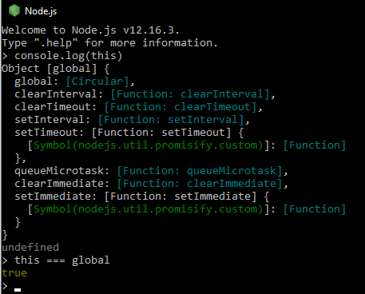

# Types, Values and Variables


- [Basic Definitions](#Basic Definitions)
- [Numbers](#Numbers)
  - [Integer Literals](#Integer Literals)
  - [Floating-point Literals](#Floating-point Literals)
  - [Arithmetics in Javascript](#Arithmetics-in-Javascript)
  - [Dates and Times](#Dates and Times)
  - [Other Values](#Other-Values)
- [Text](#Text)
- [Boolean Values](#Boolean-Values)
- [Null, Undefined and NaN](#Null,-Undefined-and-NaN)
- [Conversions](#Conversions)
- [Variables](#Variables)
- [The Global Object](#The-Global-Object)
- [¿Que es scope?](#¿Que-es-scope?)


Computer programs work by manipulating **values**, such as the **number** 3.14 or the **text** “Hello World.” **The kinds of values that can be represented** and manipulated **in a programming language** are known as **types**, and one of the most fundamental characteristics of a programming language is the set of types it supports. 


## Basic Definitions


| Names      | Description                                                  |
| ---------- | ------------------------------------------------------------ |
| Values     | In javascript values are chunks of bits that represent pieces of information. These can be numbers, text or boolean values. |
| Types      | Types are values that can be manipulated in a programing language. |
| Variable   | Variables are containers for storing data (storing data values). |
| Objects    | Objects are variables too. But objects can contain many values. These values inside the object are called properties. |
| Method     | JavaScript methods are actions that can be performed on objects. A JavaScript **method** is a property containing a **function definition**. |
| Properties | Properties are the values associated with a JavaScript object. Properties can be changed, added, and deleted, but some are read only. |
| Function   | A JavaScript function is a block of code designed to perform a particular task. |


## Types


### Primitive Types

JavaScript types can be divided into two categories: **primitive types** and **object types**. JavaScript’s primitive types include: 

- numbers.
- strings of text.
- Boolean truth values.
- null
- undefined.


### Object Types

Any JavaScript value that is not a number, a string, a boolean, or null or undefined is an object. An object is a collection of properties where each property has a name and a value. JavaScript’s Object types include: 

- Global Object
- Array
- Function
- Classes (These can be thought of as as subtype of the object type)


## Numbers


### Integer Literals

In a JavaScript program, a base-10 integer is written as a sequence of digits. For example:

```js
//Base 10 Integers
0 
3
1000  
```


JavaScript also recognizes hexadecimal (base-16) values. A hexadecimal literal begins with “0x” or “0X”, followed by a string of hexadecimal digits.

A hexadecimal digit is one of the digits 0 through 9 or the letters a (or A) through f (or F), which represent values 10 through 15. Here are examples of hexadecimal integer literals:

```js
// Base 16 Integers 
0xa // = 10
0xf // = 15
```


### Floating-point Literals

Floating-point literals can have a decimal point; they use the traditional syntax for real numbers. A real value is represented as the integral part of the number, followed by a decimal point and the fractional part of the number.

```js
// Floating-point Literals
1.6
6.7
42.5
```


Floating-point literals may also be represented using exponential notation: a real number followed by the letter e (or E), followed by an optional plus or minus sign, followed by an integer exponent. This notation represents the real number multiplied by 10 to the power of the exponent.

```js
// Floating-point Literals with letter e
6.02e23 // 6.02 × 1023

```


### Arithmetics in Javascript

JavaScript programs work with numbers using the arithmetic operators that the language provides. These include + for addition, - for subtraction, * for multiplication, / for division, and % for modulo (remainder after division).

In addition to these basic arithmetic operators, JavaScript supports more complex mathematical operations through a set of functions and constants defined as properties of the Math object:

```js
Math.pow(2,53)				// => 9007199254740992: 2 to the power 53
Math.round(.6)				// => 1.0: round to the nearest integer
Math.ceil(.6)				// => 1.0: round up to an integer
Math.floor(.6)				// => 0.0: round down to an integer
Math.abs(-5)				// => 5: absolute value
Math.max(x,y,z)				// Return the largest argument
Math.min(x,y,z)				// Return the smallest argument
Math.random()				// Pseudo-random number x where 0 <= x < 1.0
Math.PI						// π: circumference of a circle / diameter
Math.E						// e: The base of the natural logarithm
Math.sqrt(3)				// The square root of 3
Math.pow(3, 1/3)			// The cube root of 3
Math.sin(0)					// Trigonometry: also Math.cos, Math.atan, etc.
Math.log(10)				// Natural logarithm of 10
Math.log(100)/Math.LN10		// Base 10 logarithm of 100
Math.log(512)/Math.LN2		// Base 2 logarithm of 512
Math.exp(3)					// Math.E cubed
```


### Dates and Times

Core JavaScript includes a Date() constructor for creating objects that represent dates and times. These Date objects have methods that provide an API for simple date computations.


These don't represent a fundamental type like numbers so I'm going to leave some examples and late on we'll further explanation:

```js
var then = new Date(2010, 0, 1);				// The 1st day of the 1st month of 2010
var later = new Date(2010, 0, 1, 17, 10, 30); 	// Same day, at 5:10:30pm, local time
var now = new Date(); 							// The current date and time
var elapsed = now - then; 						// Date subtraction: interval in milliseconds
later.getFullYear() 							// => 2010
later.getMonth()								// => 0: zero-based months
later.getDate()									// => 1: one-based days
later.getDay()									// => 5: day of week. 0 is Sunday 5 is Friday.
later.getHours()								// => 17: 5pm, local time
later.getUTCHours()								// hours in UTC time; depends on timezone
later.toString() 								// => "Fri Jan 01 2010 17:10:30 GMT-0800 (PST)"
later.toUTCString() 							// => "Sat, 02 Jan 2010 01:10:30 GMT"
later.toLocaleDateString() 						// => "01/01/2010"
later.toLocaleTimeString() 						// => "05:10:30 PM"
later.toISOString()								// => "2010-01-02T01:10:30.000Z"; ES5 only
```


### Other Values

| Values    | Description                                                  |
| --------- | ------------------------------------------------------------ |
| Infinity  | Is a number that represents positive infinity.               |
| -Infinity | Represents negative infinity.                                |
| NaN       | Represents a non-numeric value. Is the result of an invalid mathematical operation. |


```js
console.log(7 / 0);	// Infinity
console.log(-7 / 0);	// -Infinity
console.log("Hello World" * 2);	// NaN
```


## Text

A string is an immutable ordered sequence of 16-bit values, each of which typically represents a Unicode character—strings are JavaScript’s type for representing text. 


### String Literals

To include a string literally in a JavaScript program, simply enclose the characters of the string within a matched pair of single or double quotes (' or "). 

```js
// String Literals

"This is a string"
'This is another string'
```


### Quotes within quotes.

Double-quote characters may be contained within strings delimited by single-quote characters, and
single-quote characters may be contained within strings delimited by double quotes. 

```js
// Strings with quotes 

"This is a 'string'"
'This is another "string"'
```


### Line breaks

We can break a string with a backlash.

```js
//Line Break
"This is in the first line\nThis is in the second line. "
```


### Escape Sequences in strings literals

An escape sequence represents a character that is not otherwise representable within the string. For example:


| Sequence | Character Represented                                        |
| -------- | ------------------------------------------------------------ |
| \0       | The NUL character (\u0000)                                   |
| \b       | Backspace (\u0008)                                           |
| \t       | Horizontal tab (\u0009)                                      |
| \n       | Newline (\u000A)                                             |
| \v       | Vertical tab (\u000B)                                        |
| \f       | Form feed (\u000C)                                           |
| \r       | Carriage return (\u000D)                                     |
| \ "      | Double quote (\u0022)                                        |
| \ '      | Apostrophe or single quote (\u0027)                          |
| \\       | Backslash (\u005C)                                           |
| \x XX    | The Latin-1 character specified by the two hexadecimal digits XX |
| \u XXXX  | The Unicode character specified by the four hexadecimal digits XXXX |


### Working with strings


#### Concatenate

One of the built-in features of JavaScript is the ability to concatenate strings. If you use the + on strings, it joins them by appending the second to the first. For example:

```js
// Concatenate Strings
"Hello, " + "World"
```


*Note: "Remember that strings are immutable in JavaScript. Methods like replace() and toUpperCase() return new strings: they do not modify the string on which they are invoked".*


#### Accessing a string

strings can be treated like read-only arrays, and you can access individual characters (16-bit values) from a string using square brackets instead of the charAt() method:

```js
s = "hello, world";
s[0]			// => "h"
s[s.length-1]	// => "d"
```


### Pattern Matching

In JavaScript, a **RegExp Object** is a pattern with **Properties** and **Methods**. Is used to do pattern-matching **"search-and-replace"** functions on text.

```js
const string = "This is a string";
const regex = /is/g;  //Match the letters "is"
const isExisting = regex.test(string);
console.log(isExisting);
```

In the previous example we created a variable with a string. Then we find the "is" match within the string.  If the regex find the combination it will be displaying in the console log "true".


## Boolean Values

A boolean value represents truth or falsehood, on or off, yes or no. There are only two possible values of this type. The reserved words true and false evaluate to these two values.

```js
// Boolean Values
let bool = true
let bool2 = false
```


## Null, Undefined and NaN


### Undefined

Is a variable that has not been assigned a value. 

```js
let und; 
```


### Null

"Undefined" Is a variable that has not a value.

"Null" tells us that the variable is created and has a value. This value represents an empty or unknown value. 

```js
let Null = null;
```


### NaN

In JavaScript, NaN is short for "Not-a-Number". NaN is a number that is not a legal number.

```js
let str7 = "Number";
let nan = str7 * 5;
console.log(nan);
```


## Conversions

La coerción de datos o type coercion es el proceso de convertir un valor de un tipo de dato a otro, por ejemplo, string a number, boolean a string, etc. Dicho proceso se puede dar de manera tanto explícita como implícita.

La forma explícita es cuando se quiere hacer de manera intencional usando las funciones adecuadas como `String(value)` o `Number(value)`, a esto también se le conoce como type casting.

Anteriormente mencionamos que JavaScript es un lenguaje de tipado débil, es por ello que los valores pueden cambiar de tipo de dato de manera automática, esto es la coerción de datos implícita. Usualmente pasa cuando aplicamos algún operador a valores con tipos de datos distintos.

En JavaScript sólo existen tres tipos de conversiones posibles:

- String
- Number
- Boolean


### String Conversion

Para convertir un valor a string de manera explcícita usamos la función `String()`. La coercion implícita se da cuando usamor el operador `+` y cualquiera de los operandos es un string.

```js
String(123);	// Explícito
123 + '';	// Implícito
```

Todos los valores primitivos se pueden convertir en strings.

```js
String(123);	// '123'
String(3.14);	// '3.14'
String(true);	// 'true'
String(false);	// 'false'
String(undefined);	// 'undefined'
String(null);	// 'null'
```


### Numeric Conversion

Para convertir explícitamente un valor a tipo numérico se aplica la función `Number()`. Le coerción implícita es un poco más compleja que la de strings porque se da en distintias formas, como el uso de operadores aritméticos, toma en cuenta que para el caso del operador `+` es string conversion y no numérico si uno de los operandos es string, como ya se mencionó anteriormente.

```js
Number('123');	// Explícito
+ '123';	// Implícito
1 - '1';	// Implícito
2 * '2';	// Implícito
```


Los valores primitivos también pueden ser convertidos a tipos numéricos con distintos resultados.

```js
Number(' 10 ');	// 12
Number('-10');	// 10
Number('123abc');	// NaN
Number(true);	// 1
Number(false);	// 0
Number(null);	// 0
Number(undefined);	// NaN
```


### Boolean Conversion

Al igual que con strings y números, para una conversión explícita se usa una función, en este caso es `Boolean()`. La coerción implícita se da en un contexto lógico o al usar operadores lógicos.

```js
Boolean(1);	// Explícito
if(1) { ... }	// Implícito - Contexto lógico
!!2;	// Implícito - Operador lógico
2 || 'Hello World';	// Implícito - Operador lógico
```


### Conversion an Equality

Because JavaScript can convert values flexibly, its == equality operator is also flexible with its notion of equality. All of the following comparisons are true, for example:

```js
null == undefined 	// These two values are treated as equal.
"0" == 0 			// String converts to a number before comparing.
0 == false 			// Boolean converts to number before comparing.
"0" == false		// Both operands convert to numbers before comparing.
```


### Object to Primitive Conversions

We also have some conversion methods to convert object to primitive values.

- Boolean()
- toString()
- valueOf()


## Variables

Las variables son contenedores de datos los cuales se guardan en la memoria y se pueden utilizar.

Para declarar una variable primeramente escribimos la palabra "var" que se utilizar para decirle a la computadora que el código es una variable, posteriormente se le define un nombre a la variable y se define su contenido.

```javascript
var recipiente = "papel";
```

Las "variables" se les denominan así porque su contenido puede cambiar.

```javascript
var recipiente = "carton";
```

Para utilizar una variable seleccionamos el nombre que se le fue asignado a la variable y lo asignamos a la accion que queremos hacer.

```javascript
var recipiente = "papel";
console.log(recipiente);
```

El console log imprimirá la variable "recipiente" en la terminal, que el valor de la variable es "papel".


Las variables se dividen en 4 partes:

```js
var deporte = "Atletismo";
```

- **Declaración (`var`)**. Cuando comienzas una variable, debes de utilizar la palabra `var`
- **Nombre (etiqueta)**. Irá del lado izquierdo. Será cómo llamarás la variable más adelante.
- **Asignación (`=`)**. A diferencia de la aritmética donde se le conoce como "igual", en Javascript se le conoce como asignación, el cual asignará el valor de lo que el área de su lado derecho genere hacia el lado izquierdo (Nombre).
- **Valor (Tipo de dato)**. Puede ser un texto, un número, un conjunto de datos (objetos, arreglos).


### Formas de declarar una variable

Ahora bien, nombrar tus variables implica que deberán ser lo más descriptivas posibles.

Es decir, que si otras personas leyeran tu código, entenderían rápidamente que significa cada dato porque el nombre de su variable lo explica todo

```js
var saludo = "Hola Mundo";
var perro = "Firulais";
var pais = "México";
var edad = 35;
```

Si tú lees el nombre de las variables anteriores, rápidamente comprendes de qué tratan.

Si generas una variable que implica dos palabras, te recomendamos usar una técnica llamada **"Camel Case"**.

Observemos un ejemplo:

```js
var paisLatinoamericano = "México";
var animalVerde = "Rana";
var impuestosAnuales = 250000;
```

**"Camel Case"** implica:

- Conectar ambas palabras sin espacio, volviéndola una.
- La palabra comenzará con minúscula.
- La segunda palabra empezará con mayúscula.


### var (global / local scope)

To declare a variable in a global scope we declare it outside of the fuction, to declare it as a local scope, we declare it inside the fuction.

```javascript
//global
var pan = "donas";

//local
function panadero(){
  var pan = "donas";
}
```

_"Note: Las variables definidas como local scope no se pueden utilizar en el global scope o afuera de su función"_


### var Problem

El problema de var es que se puede redefinir, si volvemos a declarar la misma variable esta se redefine dando un resultado diferente. Por ejemplo;

```javascript
var greeter = "hey hi";
var times = 4;

if (times > 3){
  var greeter = "say hello instead";
}

console.log(greeter)//"say hello instead"
```

Esto va imprimir la variable redefinida dentro del bloque.


### let (Local Scope)

Estas variables es como var pero es una versión mejorada. Para corregir el hecho de que cambia el valor si se utiliza el mismo nombre de una variable local en una global y que este se cambie, se utiliza "let".

Let es "block scoped". Es decir, solo se puede acceder dentro del bloque o el scope declarado.

```javascript
let greeting = "say hi";
let times = 4;

if (times > 3){
  let hello = "say hello instead";
  console.log(hello);
}

console.log(hello)//hello is not defined
```

Usamos la variable hello dentro del bloque, esto quiere decir que solo está definida dentro de ese bloque, si se queire utilizar afuera del bloque saltará un error.


### const

Estas declaraciones al igual que let solo se pueden utilizar en un execution context o bloque. const viene de constantes, esto quiere decir que se mantienen igual y no pueden ser redeclaradas.

```javascript
const greeting = "hi";
const greeting = "hello";
```

Esto botará un error porque ya fue declarada una vez y no puede cambiar su valor.

Mientras que la variable const no puede ser redefinida, sus propiedades si lo pueden ser

```javascript
const greeting = {
  message: "say hi",
  times: 4
}

greeting.message = "say hello instead";
```

Al llamar a la propiedad utilizando el punto depúes de su variable podremos redefinir esta propiedad.


### Declarar múltiples variables

Para declarar múltimples variables existen varias formas de hacerlo. 

Declarar las variables en una linea y definirlas por separado.

```javascript
let numero, numero2, numero3;
numero = 2;
numero2 = 9;
numero3 = 13;
```

Se pueden declarar en diferentes lineas y definirlas en la misma linea declarada.

```javascript
let numero = 2;
let numero2 = 9;
let numero3 = 13;
```


## The Global Object

A global object is an object that always exists in the global scope.

The global object provides variables and functions that are available anywhere. By default, those that are built into the language or the environment.

When the JavaScript interpreter starts it creates a new global object and gives it an initial set of properties that define:

- global properties like undefined, Infinity, and NaN.
- global functions like isNaN(), parseInt(), and eval().
- constructor functions like Date(), RegExp(), String(), Object(), and Array().
- global objects like Math and JSON


### Window Object

The `window` object is the Global Object in the Browser. Any Global Variables or Functions can be accessed as *properties* of the `window` object.


## ¿Que es scope?

Scope es la accesibilidad que tienen las variables, funciones y objetos en partes específicas del código durante el tiempo de ejecución. En otras palabras, el scope determina la visibilidad de las variables en áreas del código.

JavaScript cuenta con dos tipos de scope: global y local. Las variables dentro de una función se encuentran en un scope local, aquellas definidas fuera de una función están en un scope global.


### Scope global

Al momento de empezar a escribir en un documento de JavaScript ya estás en un scope global y solamente existe uno, que es todo el documento. Todas las variables que estén definidas fuera de una función se encuentran en el scope global. Esto significa que se puede acceder a dichas variables e incluso modificarlas desde cualquier otra parte del código, incluso dentro de una función.

```javascript
var name = "John Doe";

console.log(name); // "John Doe"

function foo() {
  console.log(name); 
}

foo(); // "John Doe"
```


### Scope local

Las variables definidas dentro de una función se encuentran en un scope local, esto significa que solo se puede acceder a ellas dentro de la función donde se definió la variable. Esto te permite tener variables con el mismo nombre en distintas funciones, cada una de esas variables estará ligada a su respectiva función.

```javascript
function foo() {
  var name = "John Doe";
  console.log(name); 
}

foo(); // "John Doe"

console.log(name); // Uncaught ReferenceError: name is not defined
```

Sentencias de control de flujo y bucles como `if/else`, `switch`, `for` o `while` no crean un nuevo
scope como lo hacen las funciones. Cualquier variable declarada dentro de estos bloques tendrá el mismo scope donde se declaró la sentencia.


### Execution context

El ambiente en el cual cada línea de código es ejecutada se conoce como Execution Context. Cada vez que se llama o ejecuta una nueva función, JavaScript crea un nuevo execution context, estos se van apilando en lo que se conoce como Execution Stack.


Todas las variables y declaraciones de funciones por default forman parte del Global Execution Context, como es el caso de `name`, `first`, `second`, y `third`. Al momento de ejecutar `first()` se crea un nuevo execution context encima  del global, después de crear `var a` en este nuevo contexto se ejecuta `second()` y el proceso se repite. El contexto que esté hasta arriba en la pila es el que se está ejecutando en el momento, una vez que la ejecución finalice se elimina de la pila y se procede a ejecutar el que sigue, así hasta terminar.

Para evitar confusiones, el scope se refiere a la visibilidad de variables mientras que el contexto se refiere al valor de `this`. Es decir, conforme cambia el execution context también lo hace el objeto `this`.


### This

In JavaScript, the `this` keyword refers to an **object**. **Which** object depends on how `this` is being invoked (used or called).


### ¿Cuál es el valor de `this`?

Ya mencionamos que la ejecución de un execution context por default es global. Esto significa que `this` por default está haciendo referencia a un objeto global.

En un navegador o browser este objeto global es `window`.


Mientras que en un ambiente de Node.js `this` hace referencia al objeto `global`.




| This value                                                   |
| ------------------------------------------------------------ |
| In an object method, `this` refers to the **object**.        |
| Alone, `this` refers to the **global object**.               |
| In a function, `this` refers to the **global object**.       |
| In a function, in strict mode, `this` is `undefined`.        |
| In an event, `this` refers to the **element** that received the event. |
| Methods like `call()`, `apply()`, and `bind()` can refer `this` to **any object**. |


### `this` en nuevas instancias

Los "function constructor" nos permiten definir las propiedades de un objeto que _podría existir eventualmente_. El constructor en sí no es un objeto. Cuando usamos el keyword `new` dicho constructor nos retorna un objeto (instancia). En este caso `this` hace referencia al objeto instanciado.


```javascript
var Person = function(firstName, lastName) {
  this.firstName = firstName;
  this.lastName = lastName;
  
  this.logName = function() {
    console.log("Name: " + this.firstName + " " + this.lastName);
  }
}

// Aqui "new" creará una nueva instancia u objeto. Por lo que el método de la clase anterior hará referencia a esta nueva instancia creada.
var john = new Person("John", "Doe");
john.logName(); // Name: John Doe

var jane = new Person("Jane", "Doe");
jane.logName(); // Name: Jane Doe
```


Tenemos dos instancias de `Person` y en ambos casos `this` hace referencia a cosas distintas pese a que vienen del mismo constructor. En el caso de `john.logName`, `this` hace referencia a `john`, un instancia de `Person` pero que es una instancia diferente a `jane`, por lo `jane.logName` también hace referencia al objeto que lo contiene, es decir, `jane`.


### Cambiar el contexto de `this`

En JavaScript las funciones son un tipo de objeto. Todas las funciones tienen los métodos `call`, `bind`, y `apply` que nos permiten cambiar el contexto de `this` al momento de ejecutar la función. En la sección anterior vimos cómo `this` cambia para cada instancia de `Person`.

```javascript
var Person = function(firstName, lastName) {
  this.firstName = firstName;
  this.lastName = lastName;
  
  this.logName = function() {
    console.log("Name: " + this.firstName + " " + this.lastName);
  }
}

var john = new Person("John", "Doe");
john.logName(); // Name: John Doe

var jane = new Person("Jane", "Doe");
jane.logName(); // Name: Jane Doe
```


Sabemos que al ejecutar `john.logName()` el contexto de `this` es `john`. Podemos llamar la misma función y darle un nuevo contexto con el método `call`.

```javascript
//Aquí "call" nos permite cambiar el conexto de "this". Así en vez de utilizar la función "logName" de la instancia "john" utilizará la función de la instancia "jane".

john.logName.call(jane); // Name: Jane Doe
```


La única diferencia entre `call` y `apply` es la forma en que se pasan los argumentos. Con el método `call` pasamos los argumentos separados por coma, mientras que en el caso de `apply`, el segundo argumento debe ser un arreglo con los argumentos restantes.

El método `bind` retorna una nueva función con `this` haciendo referencia al primer argumento que se pasó.

```javascript
var showName = john.logName.bind(jane);

showName(); // Name: Jane Doe
```


[Back to top](#Types, Values and Variables)